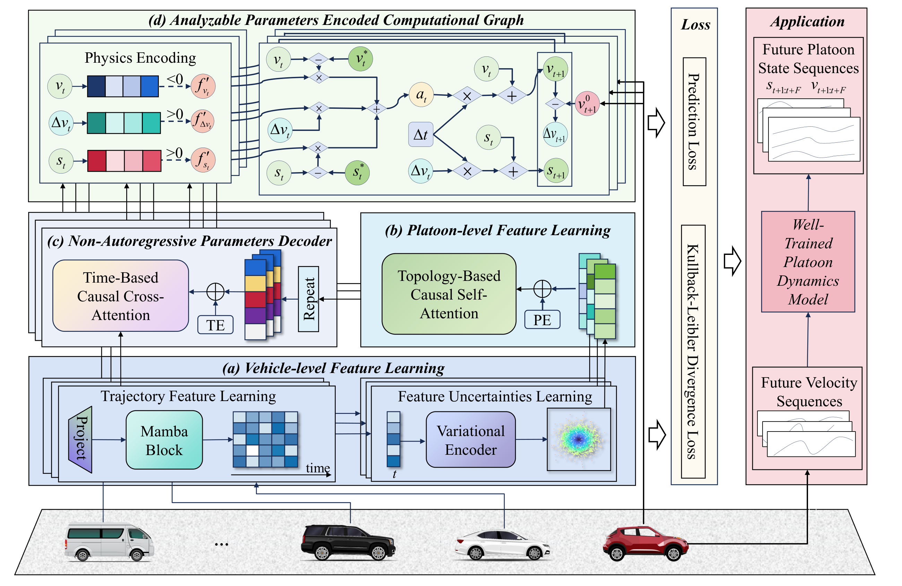
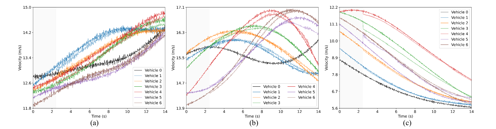
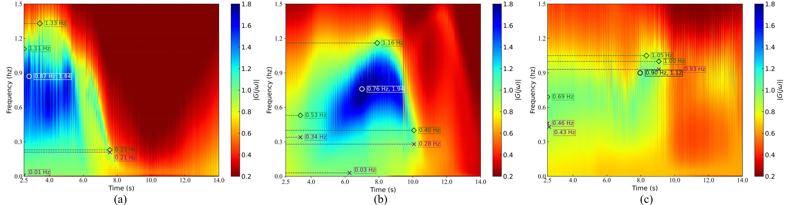
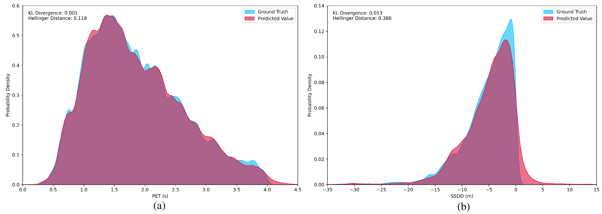
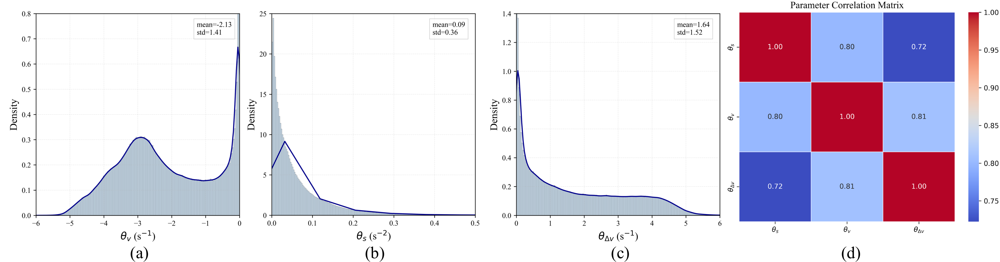

# PeMTFLN

Official PyTorch implementation for **Knowledge-data fusion dominated vehicle platoon dynamics modeling and analysis: A physics-encoded deep learning approach**.

[Paper](https://doi.org/10.1016/j.inffus.2025.103622) | [Citation](CITATION.bib)



PeMTFLN is a physics-encoded deep learning model for nonlinear vehicle platoon dynamics. It combines a **Multi-scale Trajectory Feature Learning Network (MTFLN)** with an **Analyzable Parameters Encoded Computational Graph (APeCG)** so that learned platoon responses remain both accurate and physically interpretable under lead-vehicle perturbations.

## Highlights

- Physics-encoded platoon dynamics through learnable, time-varying physical parameters.
- Multi-scale vehicle and platoon feature extraction with Mamba and Transformer blocks.
- Directly reusable paper checkpoint for HIGH-SIM evaluation.
- Lightweight sample data for smoke testing without downloading the full processed dataset.

## Repository Layout

```text
PeMTFLN/
  pemtfln/                 # Refactored model, data loader, losses, and evaluation API
  scripts/                 # CLI entry points for demo, training, and evaluation
  checkpoints/             # Release checkpoint kept small enough for GitHub
  data/                    # Lightweight sample arrays for quick verification
  assets/figures/          # PNG figures converted from the LaTeX project PDFs
  docs/                    # Dataset and asset notes
```

## Quick Start

```bash
pip install -r requirements.txt
python scripts/run_demo.py
```

The demo runs the released checkpoint on a tiny HIGH-SIM sample and writes metrics to `results/demo_metrics.csv`.

For an explicit evaluation command:

```bash
python scripts/evaluate_highsim.py \
  --data data/sample_highsim.npz \
  --checkpoint checkpoints/pemtfln_highsim_epoch20.tar \
  --device cpu
```

To train a small smoke-test model:

```bash
python scripts/train_highsim.py --data data/sample_highsim.npz --epochs 2 --device cpu
```

For paper-scale training/evaluation, place the full processed HIGH-SIM split at `data/platoons_data_split.npz` and pass it with `--data data/platoons_data_split.npz`.

## Checkpoint

This repository includes one compact checkpoint:

```text
checkpoints/pemtfln_highsim_epoch20.tar
```

The refactored `pemtfln.model.Encoder` keeps the original state-dict keys for model submodules, so the released checkpoint can be loaded without conversion.

## Results

Paper-scale HIGH-SIM results reported in the manuscript:

| Model | RMSE gap | RMSE speed | MAPE gap | MAPE speed |
| --- | ---: | ---: | ---: | ---: |
| PerIDM | 1.003 | 0.818 | 9.77 | 2.57 |
| PerACC | 0.913 | 0.776 | 9.07 | 2.52 |
| KoopmanNet | 0.772 | 0.695 | 7.04 | 2.20 |
| Seq2Seq | 0.796 | 0.792 | 6.93 | 2.45 |
| Transformer | 0.685 | 0.742 | 5.68 | 2.17 |
| PeLSTM | 0.581 | 0.648 | 4.09 | 1.96 |
| PeTransformer | 0.503 | 0.659 | 3.14 | 1.98 |
| **PeMTFLN** | **0.469** | **0.643** | **3.09** | **1.91** |

## Visual Results









## Data

The full processed HIGH-SIM arrays are not committed because they are several gigabytes. The included `data/sample_highsim.npz` only verifies the code path and file format. See [docs/DATA.md](docs/DATA.md) for the expected keys and feature order.

## Citation

```bibtex
@article{lyu2025knowledge,
  title = {Knowledge-data fusion dominated vehicle platoon dynamics modeling and analysis: A physics-encoded deep learning approach},
  author = {Lyu, Hao and Guo, Yanyong and Liu, Pan and Feng, Shuo and Ren, Weilin and Yue, Quansheng},
  journal = {Information Fusion},
  pages = {103622},
  year = {2025},
  issn = {1566-2535},
  doi = {10.1016/j.inffus.2025.103622},
  url = {https://www.sciencedirect.com/science/article/pii/S1566253525006943}
}
```
